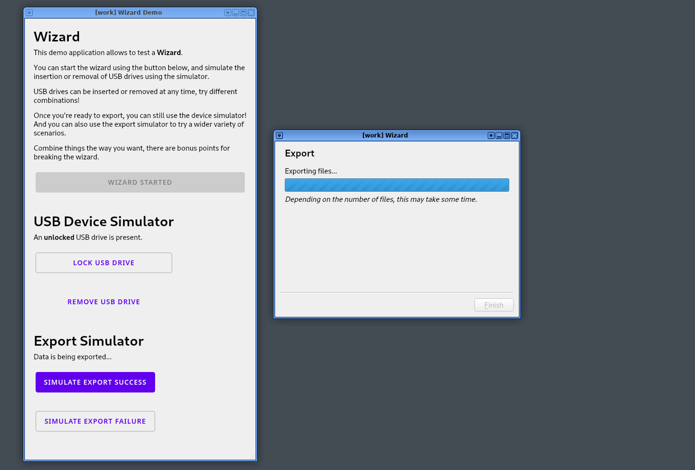
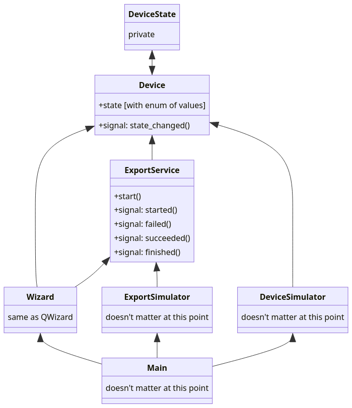

Wizard
======

A wizard that depends on an USB device with a volatile mood. (Includes a simulator where you get to play the volatile mood.) 🦢



Usage
-----

```sh
# Use Python 3.9, the version matters for Qt.
python3.9 -v venv .venv

source .venv/bin/activate
pip install -r requirements.txt

python main.py
```

Problem definition
------------------

I want to export some files to a USB device, that is potentially encrypted.

### Scope of the demo

- The files are assumed to have been selected prior to the wizard being open.
- The state of the USB device is provided by a simulator, that interface is out of scope of this demo.
- The state of the service that writes the files to the USB device is provided by a simulator, that interface is also out of scope of this demo.
- The copy of the UI is out of scope of this demo. Some is provided for illustration.
- Theming is also out of scope of the demo. Stock Qt 5 components are used in the Wizard, they can be themed. (See the [Material]-inspired buttons on the main panel for example.)
- Code-wise, only the following files are meant to be used as reference. The other ones were hacked together for the purpose of the demo, and should be considered out of scope.
  - All the files in the [`wizard/`](./wizard/) directory.
  - [`device/main.py`](./device/main.py)
  - [`export/service.py`](./export/service.py)

  [Material]: https://material.io/components/buttons

Design principles
-----------------

- Don't constrain _what_ people do or don't do with the USB device.
  - Example: the device might not be encrypted in the first place (so it would always be unlocked).
  - Example: the device might be unlocked at any point using other tools than the wizard.
- Don't constrain unnecessarily _when_ people do what they've got to do.
  - Example: the device that's present may not be the right one, changing it on the fly should be OK.
- Don't let people guessing when unexpected situations happen. Be clear with what can or needs to be done.
  - Examples: the export may fail for unknown reasons, the USB device may be yanked, a virtual machine may crash, or passphrase may be wrong.

Overview of dependencies
------------------------


